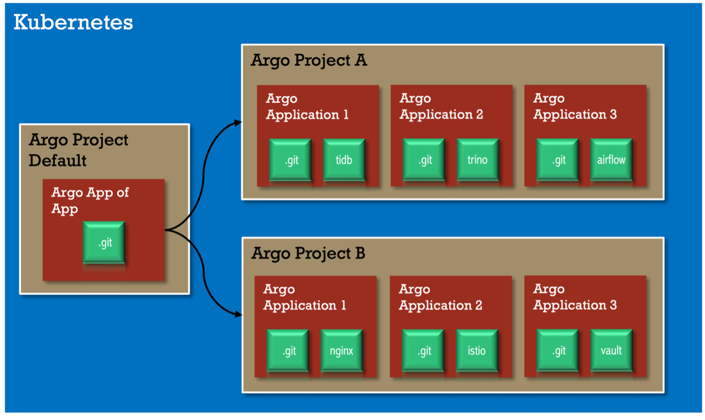

# ArgoCD poc

Deploy ArgoCD as a Github App.

Requirements:

- [Kind](https://kind.sigs.k8s.io/docs/user/quick-start/)
- [Helm](https://helm.sh/)
- [ArgoCD](https://argo-cd.readthedocs.io/en/stable/) registered as a Github App with its own key installed in the repo (fill out `configs.credentialTemplates.github-app-creds:` in [argocd/argocd/values.yaml](./argocd/argocd/values.yaml))
  - Github Settings ->  Developer settings -> GitHub Apps: Create new App and get private key.
  - Github Settings ->  Applications: Configure read access to the repo.

## Create Kind cluster

```bash
kind create cluster --config=./kind/cluster.yaml
```

## Install ArgoCD

```bash
helm repo add argo https://argoproj.github.io/argo-helm && helm repo update

kubectl create ns argocd && helm upgrade --install -n argocd argocd argo/argo-cd --version 5.14.3 --values argocd/values.yaml 
```

Access ArgoCD through `localhost:8080` (admin/argocd):

```bash
kubectl port-forward -n argocd svc/argocd-server 8080:80
```

### Change ArgoCD admin pass

Generate password:

```bash
 # If Linux:
 # sudo apt-get install apache2-utils
 ARGO_PWD=argocd
 htpasswd -nbBC 10 "" $ARGO_PWD | tr -d ':\n' | sed 's/$2y/$2a/'
```

Change the value of `configs.secret.argocdServerAdminPassword:` in [argocd/argocd/values.yaml](./argocd/argocd/values.yaml) with this password.

## Deploy ArgoCD Applications

```bash
# Deploy manifests from master branch in this repo in argocd/argocd/argo-apps/nginx-vanilla/ path.
# Update argocd/argo-apps/nginx-vanilla.yaml spec.source to read from other repo/branch/path (will require installing ArgoCD as github app if you change the repo)
kubectl apply -f argocd/argo-apps/nginx-vanilla.yaml

# Deploy Bitnami's Nginx Helm chart
kubectl apply -f argocd/argo-apps/standalone-nginx-bitnami-helm.yaml

# Deploy App Of Apps pattern
kubectl apply -f argocd/argo-apps/app-of-apps.yaml
```

### App of Apps

For [bootstraping](https://argo-cd.readthedocs.io/en/stable/operator-manual/cluster-bootstrapping/): manually deploy just one app, all other are deployed automatically through GitOps:



### Using values.yaml file or tuning a Helm chart

This is still not fully solved, but [it shoul in version 2.6](https://github.com/argoproj/argo-cd/issues/2789#issuecomment-1267242015). The most common WA is to use a "dummy/proxy" chart that does nothing but installing the desired chart as a dependency (example in dir [`argocd/argo-apps/nginx-bitnami-helm-values`](./argocd/argo-apps/nginx-bitnami-helm-values)).

Note:

- The `version:` and `appVersion:` fields of the ["dummy/proxy" chart Chart.yaml](./argocd/argo-apps/nginx-bitnami-helm-values/Chart.yaml) **mean nothing**.
  - The real chart version is `dependencies[0].version`
- The `values.yaml` file **must be indented** taking into account the `dependencies[].name`.
  - For example if `dependencies[0].name: nginx`, the `values.yaml` file starts with `nginx:` as in the [demo](argocd/argo-apps/nginx-bitnami-helm-values/values.yaml).

## Delete Kind cluster

```bash
kind delete cluster --name argocd-cluster
```

## Extra Resources

ArgoCon22 Workshops:

- [Akuity Best Practices](https://github.com/argocon2022-workshop).
- [ArgoCD/Rollouts 101/201](https://github.com/argocon22Workshop/ArgoCDRollouts)

## Other topics

- [Secrets](https://argo-cd.readthedocs.io/en/stable/operator-manual/secret-management/): just a list of general ways to handle secrets in GitOps.
- [ArgoCD and OKTA](https://argo-cd.readthedocs.io/en/stable/operator-manual/user-management/okta/)
- [ArgoCD RBAC](https://argo-cd.readthedocs.io/en/stable/operator-manual/rbac/)
- [ArgoCD HA](https://argo-cd.readthedocs.io/en/stable/operator-manual/high_availability/)
  - [Using Helm chart](https://github.com/argoproj/argo-helm/issues/172)
- Many other things: [Operator Manual](https://argo-cd.readthedocs.io/en/stable/operator-manual/)
